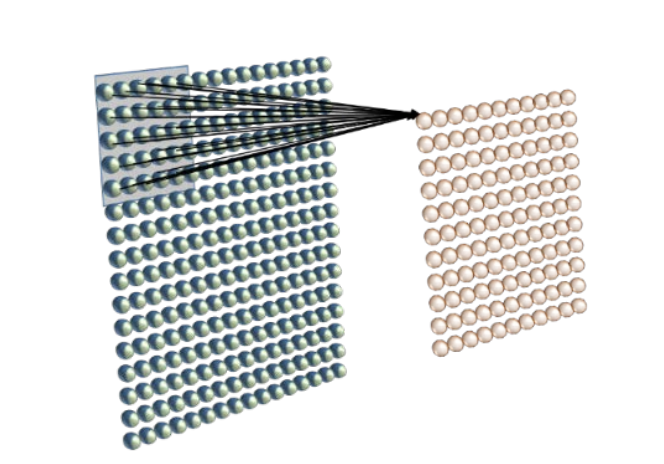
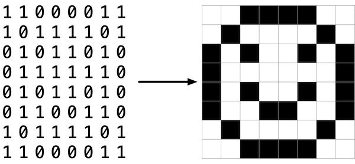
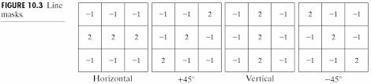

# Neurons as Feature Detectors
Biological neurons in your sensory systems can be thought of as feature detectors. This means that a single neuron 'analyzes' the visual scene by searching for a 'feature' that is **important**

One prime example of these feature detecting neurons are the 'orientation' detectors in the primary visual cortex, a brain region that is critical for vision. The neurons in this region 'analyze' different parts of an image by finding the location and orientation of edges in the image. 

There are two ways to study these neuronal feature detectors. One is to interrogate the reasons WHY the detectors exist. Why would the brain want to find certain features of the image? The other is to determine the mechanics, or physical processes, that create these feature detecting neurons. Here we'll take both approaches. 

# Why detect features?
Above I mentioned that the brain wants to find 'important' features of visual scenes. For example, neurons in the primary visual cortex respond to edge-like features in an image. What makes these edges so important? Here are some ideas...

- Object understanding
- Information Compression
- Image reconstruction

**Pulling Object information**
When we see out into world, we see order, not a chaotic arrangment of peices of light. We perceive a structured visual scene composed of objects. For each object, we can determine its distance from us and other objects, how large it is, its curvature and even texture. Everything we do is entirely based on what we know about the objects in front of us: We would run for our lives when a lion speeds towards is us, we move our hand towards food, and we change our stance when we are about to cross a puddle of mud. To navigate the world, we need to understand objects.

This is where edge detection comes in. If we can find where edges are in the visual scene we can also determine where objects are and many of there properties. We can define an edge as any sharp changes in brightness accross the visual field. These sharp changes tend to correspond to the boundaries of objects, such as the boundary between your laptop and the desk it is sitting on.    

# Mechanics of Feature Detection
Now lets discuss the mechanics, or physical processes, that allow neurons to detect these sharp edges. 

How does a neuron accomplish this feature detection?  One idea is that neuronal units build filters that resemble the image feature that they want to detect. The neuron then 'looks' at a part of the imageand calculates the similarity, or the degree to which its filter matches that image region. The more that the image region resembles the neuron's filter, the more the neuron will 'beleive' that the image region contains that feature. 

Orientation detecting neurons for example analyze a small region of the visual image and search for oriented edges within that region.  

Take a look at this illustration. The array of pink/orange-ish spheres represents that array of neurons that make up your visual cortex, while that array of blue-ish represent the the visual image that strikes your eye. Notice that each pink neuron is responsible for a specific region of the image. They must search for an edge within that region.

They do this calculating the similarity between their filter and the image region they are analyzing. 

### Images as Matrices
Now lets talk about how exactly neurons determine the simlarity between their filter and the feature within in some image region. To do this we need to start thinking of all images as an matrix of pixels where each pixel has some luminance value associated with it. The larger the value, the 'lighter' the pixel is. Lets keep it simple only think about black and white images. Its not too difficult to see the resemblance between the image and its corresponding matrix of numbers...

The pixels of an image and their associated 'luminance' values correspond to the inputs received by the neuron. Notice how the neuron 'looks' at a small part of the visual image. 

Neurons are smart. They designed their filters to resemble the feature they are looking for. When the neuron's filter passes over some part of the image, it can determine how much that image region matches its own filter. If the it matches, then the neuron activates, signaling the rest of the brain that the feature is there.

Lets Try it!
- Can you find the regions of Luminance changes in Image? 
- Finding contrast in Images: https://classroom.udacity.com/courses/ud955/lessons/3186188679/concepts/32337687700923

### Filters
Similarly, we need to think about neuron's and their filters as a matrices as well. However, DONT these matrices arent pixels. Instead think of them as weights that will be applied to the local region of the image pixels that the the neuron receives as inputs.   That is, the lines that connect the inputs to the neuron in  [figure X](link to fig) all have different weights that they apply to their inputs.

The local image region that the neuron looks at, and the weights that the neuron applies to inputs within this region, is referred to as the unit's [spatial receptive field](link to info on receptive fields)

<u>Relationship to the perceptron</u>
This is what the neuron's filter would look like if it were converted to a matrix. You can think about these number representing the strength and diection of the weight that is applied to the pixels. 

[Pratt](DIP_Ch15)

### The Linear Combination
Now that we've phrased images as an array of pixels, and filters as a matrix of weights assigned to image pixels, we can try answering the question: *how do neurons determine the similarity between their filter and the pixels that make up an image region?*

A linear combination is one of many methods of computing the similarity between two entities. In this case, the neuron wants to determine the similarity between its filter and a local image region, and it can do this by taking each input, multiplying it by its corresponding weight, and adding the result. The larger the output, the more that the image region resembles the neuron's filter, and the more the neuron will 'beleive' that the image region contains that feature. 

Notice how the filter IS essentially the array of weights that the neuron assigns to each of its pixels (see the perceptron model above). 

- Some of its weights are strong in magnitude (large negative or positive), while others are weak (weights near 0) or inexistant (the weights outside of the filter) . 

Further more, notice that the pixels can be thought of as the inputs to the neuron

