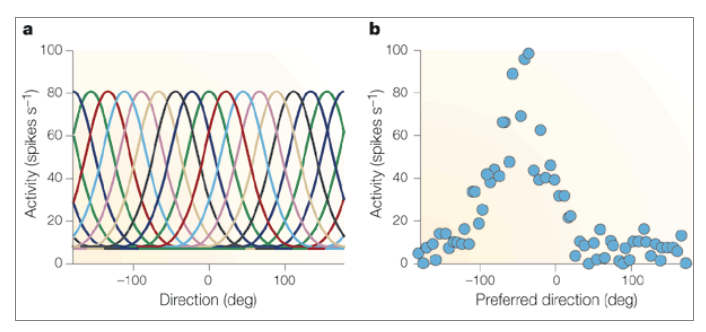

# Tuning curves and Perception
A key tool used to understand neurons is to study their *tuning curves*. Many types of tuning curves exist. They will be alluded to often in these notes, so study them well. Note that these tuning curves may sometimes be referred to as tuning *profiles, or kernels*. 

[Intro figure: Retinal tuning](bcmASSETS/thesispres_retinal_tuning_slide.png)
[CS size-response function](https://isle.hanover.edu/Ch03Eye/Ch03Kuffler_evt.html)

# 'Perceiving' Orientation
Lets go over how our visual system allow us 'know', or 'perceive' the orientation of an object.

### Orientation Tuned Cells
Humans have visual neurons, or 'units', that are *tuned to the orientation*  of elongated stimuli. For example, when you turn your gaze towards a grating composed of vertical bars, a set of neurons begin become activated. There are several key properties about these cells...

> When a neuron is **tuned to orientation**, it will respond specifically to a stimulus is elongated, not stimulus that is circular in shape

> The neurons also exhibit a *base line* level of activation, firing every so often, even when not being stimluated.

> Each unit has a **preferred orientation**. It activates most when a stimulus is at a particular orientation. Different units have different preferred orientations.

> Although a unit has a preferred orientation, it will also respond, though less strongly, to stimuli in somewhat different directions. The strength of the unit's response is inversely related to the difference between its preferred orientation and the orientation of the stimulus. The large this difference, the weaker the response. 

We can visualize these properties using a simple plot, known as the orientation tuning curve. Notice that the neuron in this example responds the most to a stimulus tilted to 90 degrees but also to other orientation 

## Bell shaped tuning curves
Remember our discussion on [tuning curves](). Orientation Tuning curves are a description of a neurons output in response to an oriented stimulus. A classical tuning curve of orientation selective neurons is roughly bell shaped, .  

### Off-balanced networks
So how does the activity of these cells inform us about the angle of an object in the visual scene?

When there are no elongated objects in your visual field, orientation tuned cells are relatively silent, only firing at some baseline rate. In this scenario, all of your orientation tuned cells are in a nicely 'balanced' state: no single group orientation tuned cells is 'winning' over another group. 

What happens you view a orientated object, for example, a vertical grating? Such a stimulus will activate neurons that prefer vertical orientations,  while units tuned to different orientations remain unaffected. In this scenerio, the activity of the network is **off-balanced**. When neurons are in this imbalanced state, you know the orientation of the object: your brain tells you there is a vertically grating because neurons that are tuned to vertical orientations are more active than the rest.

<u>Lets highlight two key points that have been made up to this point</u>
- Your visual system contains units that are tuned to a variety of orientations.
- Orientation is perceives when there is an imbalance in the activity of cells tuned to different orientation. 

## Population response
When a **population** of visual cells with these bell shaped tuning curves respond to some oriented stimulus, they exhbitit a non-uniform response function.  Namely the tuning curve of the population also shows a bell shaped curve, as seen in figure B. This is an example of an [imbalanced state of activity that we discussed before]()
