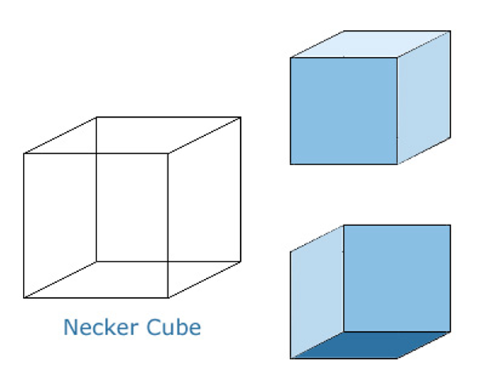

# Intro
Here is a fun and simple presentation to expose students, of any age, to various illusions with some simple explanations of how they happen. Some explanations are oversimplified. They are not rigourous treatments of the topics, but instead a fun module to introduce illusions.   

# Blind Spot

What to do

Close your left eye. You may see a part your nose, that's the blob on the lower left. 

Fully stretch out your left arm, make a partial fist, index finger pointing straight up, thumb pointing straight to the right. Fixate the top of your index finger (indicated by the bull's eye). 

Fully stretch out your right arm, shape like for the left hand. Let your thumbs just touch, and wiggle your right index finger a little (arrows).

Keep your gaze on the top of the left index finger, but with your “inner eye” observe the top of the right index finger – don't directly look at it, keep your gaze steadily on the left index finger (the one with the bull's eye).

What to see (or not)
The basic observation: Your right index finger should seem to vanish at its top. If this does not occur for you, check:
•	Did you close the right left eye :) … etc.
•	 Are the arms fully stretched out?
•	 Thumbs nearly horizontal? [They should not overlap; a tiny gap might even help.]

Once you've dis covered your blind spot, experiment a little – it's amazingly large. Also try it for the other
eye; you'll notice that its position is mirrored.

# Adaptation Illusions
## Motion Induced Blindness 

Instructions

Have ½ of the student fixate on the center (the flashing red/green spot). Tell them to not to let their gaze wander from it. 

The other ½ of the students should look at the yellow dots. Tell them to move their gaze from one yellow dot to the other.

Both sets of students should pay attention to the yellow dots. The group of students who fixate may not be able move their eyes, but they should be able to use their ‘inner eye’ to focus on the yellow dots. 
 
Effect
Ask your students what they saw: 
-	Those that fixated on the center should have experienced the yellow spots disappearing once in a while: singly, in pairs or all three simultaneously.
-	 Those that looked at the yellow dots will say that the yellow dots were continually present. 

Have each group switch tasks.

Explanation
See the Troxler effect (cat illusion)

## Troxler Effect

Instructions
Keep very still and keep your gaze focused on the central black cross. Do not strain your eyes, but also try not to let your gaze wander from the cross. Wait at least 30 seconds for this effect to take place (some people take longer).

Effect
The peripheral areas of the figure will slowly begin to fade from view. The cat's grin will fade last, leaving only the central black cross.

Explanation
Fixating one’s gaze on some element in the visual field can cause surrounding stationary images to seem to slowly disappear or fade. They are replaced with an experience, the nature of which is determined by the background that the object is on. Why?

Neurons become desensitized (i.e. they stop responding) when they are stimulated for an extensive period of time.
-	When you look at an object, its image will be projected onto the back of your eye, and stimulate a set of neurons. Those neurons, in turn, will signal to the brain that the object is present. 
-	By not moving your eyes, objects in your field of view (e.g. the yellow dots, or cat) will stimulate the same set of neurons repeatedly. Over time, these neurons will reduce their activity and, eventually, will stop telling your brain that an object is there. Once this signal ceases, you no longer perceive the object.
-	Allowing your gaze to move (which one does constantly under normal viewing conditions) will essentially shift the images that project onto the back of your eye, which will prevent neurons from desensitizing. 

## MAE (Waterfall Illusion)

Instructions:
Gaze at the movie (keep your eyes still by fixating the blue dot in the center). Continue to fixate after the image changes to experience the effect (this may take a while)

Effect
The effect is that the stationary object will move in the opposite direction of the original moving object. 

Explanation 
Your brain contains neurons that respond only to objects that move in particular directions. Some respond to upward motion, while others respond to downward motion; some to leftward motion and others to rightward motion. 

When you see movement, your brain is comparing the activity of all these motion neurons: the motion ‘preference’ of the most active group of neurons will be the direction of motion that you see. 
-	When there are no moving objects, all motion selective neurons will be responding the same way.
-	When an object is moving to the right, then neurons that prefer rightward motion will be most active.
Recall that when you stimulate a group of neurons for too long (such as when you stare at the same object repeatedly) that neuron becomes desensitized and reduces its activity. 
-	When you stare at this downward movement for too long, you are desensitizing the group of neurons that prefer to downward motion. 
-	When you look away, neurons that detect movement in the opposite direction (e.g., upwards) are more active in comparison. This results in the appearance of the stationary object moving in the latter direction (upwards).

# Contrast Enhancement 

## Mach Bands

What to see
There is a dark area and a light area, the gap filled by a luminance ramp. The luminance ramp goes up, and then stays constant (black function). The visual impression, however, is a bright band the right end of the ramp, and a darkish band the left end of the ramp (the dotted red function)

Comment

See Hermann Grid Explanation

## Herman's Grids

Instructions
Allow your gaze to roam around the figure. Focus at one of the intersection points from time to time.

Effect
Illusory grey dots or 'smudges' will appear at the intersection points of the white grid lines. The grey dots will disappear if you try to focus on them.

Comment
Consider two regions of the back of your eye as you look at the grid. 
-	One region views an intersection of a white horizontal and vertical band (red circle) 
-	the other region views a white band between two intersections (blue region). 

Although, the two regions themselves receive the same amount of light, the situation in their neighboring regions is different. 
-	At the intersection, there is light coming in from all four sides,
-	 but in the white band that lies between the two intersections it is surrounded by two dark sides.

This leads to a physiological mechanism called lateral inhibition, which has the effect of causing a bright surround to an area appear darker and, conversely, a dark surround will make an area appear lighter:

The back of your eye contains receptors of light. These receptors are arranged in rows on the inside of your retina. If you illuminate a single receptor A you will get a large response; however, when you add illumination to A’s neighbors, the response in A will decrease. In other words, illumination of receptors "inhibits" of firing of neighboring receptors.

 In the case of the Hermann grid, there is light coming from the four sides of the intersection, but from only two sides of a band going away from the intersection. The region viewing the intersection is more inhibited than the region of the band going away. Thus, the intersection appears darker than the other section. You see dark spots at the intersections of the white bands, but not at the points away from the intersections

# Context Matters
## Adelson's Checkerboard

Instructions
Look at the two target squares labelled "A" and "B". Is one darker than the other? Likewise, in the folder paper image, compare the brightness of the squares with the two dots.

Effect
The tile labelled "A" appears significantly darker than the tile labelled "B". In the folded paper image, both squares seem to be of different shades of gray. But in fact, in both of these cases, they are both the same shade of grey. 

Use the other copy of the checkerboard image to compare square A with B. Have each student do this comparison.

Explanation
The amount of light that an object can reflect varies tremendously from one environment to the next (outdoor sun, clouds, indoor lighting, shadows)
-	In purely physical terms, this means that black objects in a bright setting (like a piece of coal under bright sunlight) reflect more light than white objects viewed under a dim light (like snow under the shadow of a tree)

Yet despite the piece of coal reflecting more light under bright light, you still see it as a black object, 
And although the snow reflects less light, it is still perceived as a white object. That is, the coal looks black and the snow looks white regardless of the level of illumination in the environment. 

If our brains worked like a simple, objective light meter (that determined the whiteness on the object based purely on the amount of light it reflects) we would experience the coal as being brighter than snow in the shade. But we never make this conclusion - we do not experience the brightness of objects in absolute terms. Instead, we experience brightness relative to the brightness of other objects the context. 

In the checkerboard illusion, our brain is convinced that the checkerboard pattern is regular: that the lighter squares in the pattern are all the same lightness and the darker squares are all the same darkness. Thus, even though the shadow has made square B physically darker, your brain believes that square B is identical to all other white squares.

------
Perceptual Constancy:
https://isle.hanover.edu/Ch06Color/Ch06LightnessConstancy.html
https://wolfe4e.sinauer.com/wa05.05.html

# Stimulus Ambiguity

## Introduction

Introducing This Section….
Your only “access” to the real world through your senses. That is, your senses provide you with all the information about the reality that you live in – they have to interpret, or translate, the information they receive about reality pass that on to you. Your senses must, therefore, accurately and faithfully represent the reality and the objects that surround you. If your senses misinterpret this information that can be detrimental for your survival. 

Luckily, your senses are very good at interpreting information, and you rarely have to worry about them falsely representing reality. However, there are cases where your senses become confused: Certain information can be difficult to translate, because it can be interpreted in more than one way…. 

Consider the figure below. Note that any image that your eye receives could have been created by a multitude of objects….

 
Top Left: A small square object viewed face on at a close distance has the same image as a large square object that’s farther away.
Bottom left. All these objects, viewed at different distances, will project the same square image onto your eye.
Right: Each of these objects are radically different from each other, but when viewed from the bottom, project the same exact image
In all these example, our brains have to determine which object that is responsible is causing the image that your eye receives

The objects in the figure above project the same image onto the back of your eye. Consequently, they will all activate the same set of neurons in your eye. Your brain needs to take this pattern of neural activity and determine its cause, but there could be multiple causes – many objects could have caused the exact same activity pattern! Your brain therefore becomes confused, and you begin to see the different interpretations (the different objects that could have caused the image)

## Necker's Cube
necker_cube.png

[Necker Cube link](http://www.michaelbach.de/ot/sze-Necker/index.html)

  
What to see
If you look at the blue shape above, in all likelihood you will immediately perceive a cube, slowly rotating.

If you view the cube for a prolonged time, you may perceive sudden perceptual reversal (typically every 3–5 s) between the two cube orientations as depicted on the right. There the front-back sides of the cube are clearly indicated. In the rotating Necker cube, however, both orientations are possible. By the way: Perceptual reversals of a rotating cube are accompanied by reversals of rotation direction.

What to do
●	Once you have seen the sudden reversals, you can experiment. Can you “hold” one orientation? Normally, this is not possible. After 10 s or so, it will flip again.
●	By changing gaze direction, one can select a preferred orientation.
●	Reversals can be induced by eye blinks.
Comments
First, we need to appreciate that the percept of a 3-dimensional wireframe cube is already an interpretation, which our brain performs on the 2-dimensional visual input of a flat line image on the screen. Given this image, many interpretations are possible (for instance, many wire zigzags could cast this same shadow), but our brain chooses a cube as the most likely interpretation. And both orientations are about quite as likely (the top one of the two disambiguated figures is a little more often seen).

 
## Schroeder’s Stairs

Instructions
Notice how the image can appear to be stairs running from top left to bottom right, or the an upside down version of that image. To experience the different ways the image can look, focus one at a time on the panels labeled 'A' and 'B' and try to see it as being in the foreground. 

Effect

You should experience a switch between seeing the stairs running from top left to bottom right, or an updside down version of the stairs; in the former the A panel will appear to be in the foreground, and the B panel in the background, and in the latter the B panel will appear to be in the foreground, and the A panel in the background.

## The Missing Corner

[See illusion here](http://www.michaelbach.de/ot/sze-missCornerCube/index.html)
 

Effect
The animation is immediately seen as a (blueish) cube, wiggling a bit. It is not a normal cube, but one corner is missing. If you work on it, you can see an alternative interpretation: there is a smaller cube attached to the corner, in front of the larger cube – and it rotates inversely to the large cube! There is a third alternative view: imagine you’re looking at a room corner, and a cube is placed in that corner.

It may take a while.

Comments
Without stereoscopic depth information and without clear illumination cues, all three interpretations (missing corner, daughter cube, or room corner) are geometrically possible.

## Bistable Motion

[See illusion here](http://www.slate.com/articles/health_and_science/science/2015/02/what_color_is_this_dress_a_scientist_explains_visual_ambiguity_and_color.html)
 
Which way are the dots moving? Up and down? Left or right? In a circle?

# Conclusion
 
[See Dragon Illusion Here](https://youtu.be/A4QcyW-qTUg)

 

 
