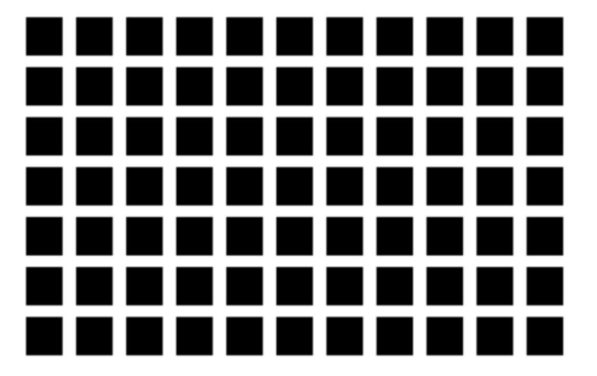

# The Neuroscience of Visual Illusions

## How do illusions help us understand the brain?
One of the most general and important questions in visual neuroscience is **HOW**  our brains allow us to see. We want to know the mechanics of the vision: what the different parts of the visual system are, and how they work together to process information from our environment. 

Many notes in this course are about visual illusions. Studying why we experience such illusions one of the key methods to understand how our visual system works. Its similar to debugging a computer program. When there is an issue or error in the program, we can dig into the code and asses where the issue lies. As we debug we can see how different parts of the program work in isolation and how influence other program. When we experience odd visual illusions, it is similar to getting an error in our program. Here we will try to understand why these visual illusions occur by debugging and dwelling into the visual system.

